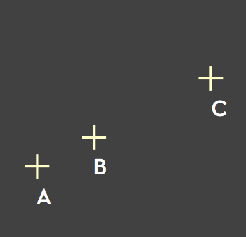

```{r include=FALSE}
library(magrittr)
library(knitr)
library(kableExtra)
```

## Administrative details

register: ideas@uga.edu

ECOL 8540  

CCN: 63694

## Downloading Github repo, setting up R/Rstudio

**Step 1. Github credentials**

You will need a GitHub account and a Personal Access Token (PAT) with "scope" set to "repo". If you do not have a GitHub PAT, you can create one as follows: 

a. Log into GitHub on the web.
b. Under your user icon, go to Settings > Developer Settings > Personal Access Tokens
c. Click `Generate new token`.
d. Name the token something relevant, click the box next to `repo`, set an expiration date if desired, and click `Generate token`.  
e. Copy the token and save it somewhere safe and permanent. You will not be able to look up the token after you close the window.

You will use this token in place of a password during the next step.

## Downloading Github repo, setting up R/Rstudio

**Step 2. Log in to the Ecology RStudio Server with your class login and password**

<https://rstudio.ecology.uga.edu/> 

**Step 3. Clone the class repository into a new R Project:**

File > New Project > Version Control > Git

Repository URL: <https://github.com/CEIDatUGA/ECOL8540-datavis.git>

Click "Browse" to choose or create the directory to put the project in. 

When asked, enter your PAT in place of a password.

## Course Overview

### Learning Objectives

By the end of this module, students should have a familiarity with the basic principles of data visualization. Students should be able to create figures covering a range of chart types and problems in ecology and infectious disease, applying best practices in data visualization.

Students will complete 6 in-class exercises on a range of topics.  In addition, students will work in groups to complete one longer project of their choosing. Groups will present completed projects to the class at the end of the course, and receive feedback from their peers.

###  Schedule: 
<https://github.com/CEIDatUGA/ECOL8540-datavis#schedule>

# Introduction to Data Visualization

## Purpose of Data Visualization
        
- **Recording of Data**  
	Collection of data in visual form (photographs, seismographs, etc.)
	
- **Analysis of Data**  
 	Pattern discovery  
	Error identification    
	Contextualization 

- **Reasoning**  
	Development and assessment of hypotheses  
	Decision making  

- **Communication**  
	Communicattion of findings (to the public or other researchers)  
	Argument  
	Storytelling  
	Inspiration / Motivation  
	Propaganda / Misinformation

## Purpose of Data Visualization
        
- **Recording**  

:::: {.flexbox}
::: {}

:::
:::{}
<small>Photograph of particle tracks in a bubble chamber,<br>with explanatory diagram. [info](https://goo.gl/vmfUCf)</small>
:::
::::

## Purpose of Data Visualization

- **Recording**  

:::: {.flexbox .vcenter}


::::

## Purpose of Data Visualization {.flexbox}

::: {}
- **Analysis **  
  <mark>Pattern discovery</mark>  
  Error identification    
  Contextualization 

:::  
::: {}
  
<small>Chart of the temperature anomalies for 1950-2013, also showing the phase of the El Niño-La Niña cycle. [NASA](http://www.giss.nasa.gov/research/news/20140121/)</small>
:::

## Purpose of Data Visualization {.flexbox}

::: {}
- **Analysis **  
  <mark>Pattern discovery</mark>  
  Error identification    
  Contextualization 

:::  
::: {}
<!--   -->


<small>Carl Sagan: Encephalization quotient. From *Dragons of Eden*. 1977</small>
:::

## Purpose of Data Visualization {.flexbox}

::: {}
- **Analysis **  
  Pattern discovery  
  <mark>Error identification</mark>    
  Contextualization 

:::  
::: {}
  

:::

## Purpose of Data Visualization {.flexbox}

::: {}
- **Analysis**  
  Pattern discovery 
  Error identification     
  <mark>Contextualization</mark> 

:::  
::: {}
  
<small>John Snow: Mapped positions of deaths from cholera in London.  
The map revealed a cluster of cases around a water pump, with density of cases  
decreasing with distance from the pump. 1854. [from Tufte 83]</small>
:::

## Purpose of Data Visualization

::: {.left-column}
- **Recording**  

- **Analysis**  
 	Pattern discovery  
	Error identification    
	<mark>Contextualization</mark> 

- **Reasoning**  
	Hypothesis assessment  
	<mark>Decision making</mark>  

- **Communication**  
	Communication of findings  
	<mark>Argument</mark>  
	Storytelling  
	Inspiration / Motivation  
	Propaganda / Misinformation
:::  

::: {.right-column-fat}
  
<small>William Playfair: trade-balance time-series chart, published in *Commercial and Political Atlas*, 1786.  [info](https://commons.wikimedia.org/wiki/File:Playfair_TimeSeries-2.png).</small>
:::

## Purpose of Data Visualization

::: {.left-column}
- **Recording**  

- **Analysis**  
 	Pattern discovery  
	Error identification    
	<mark>Contextualization</mark> 

- **Reasoning**  
	<mark>Hypothesis assessment</mark>  
	<mark>Decision making</mark>  

- **Communication**  
	<mark>Communication of findings</mark>  
	<mark>Argument</mark>  
	<mark>Storytelling</mark>  
	<mark>Inspiration / Motivation</mark>  
	Propaganda / Misinformation
:::  

::: {.right-column-fat}
  
<small>Florence Nightingale: Diagram of the causes of mortality in the military in the East. 1858.  
The diagram led directly to the understanding of sanitation in public health,  
and to drastically decreased mortality among soldiers.</small>
:::


## Purpose of Data Visualization

::: {.left-column}
- **Recording**  

- **Analysis**  
 	Pattern discovery  
	Error identification    
	<mark>Contextualization</mark> 

- **Reasoning**  
	Hypothesis assessment  
	Decision making 

- **Communication**  
	Communication of findings  
	Argument  
	<mark>Storytelling</mark>  
	Inspiration / Motivation  
	Propaganda / Misinformation
::: 

::: {.right-column-fat}
  
<small>Charles Joseph Minard: Map (1869) showing the movements and the number of Napoleonic troops during the Russian campaign (1812-1813), with temperature on the return path.</small>
:::


## {.flexbox .vcenter}


## Process of Data Visualization {.vcenter}


### Visualization = DATA &rarr; IMAGE

## Process of Data Visualization


### Visualization = DATA <mark>&rarr;</mark> IMAGE

## Process of Data Visualization

### Visualization = DATA <mark>&rarr; MAPPING &rarr;</mark> IMAGE

## Jeff Heer's Model of the Visualization Process {.flexbox}

::: {}
### Data 

**Task**  

- Questions, goals  
- Assumptions

**Data**  

- Data model   
- Conceptual model 
- Data type 

**Domain** 

- Metadata  
- Semantics  
- Conventions  
:::

::: {} 
### &rarr; &nbsp;&nbsp;
:::  

::: {}
### MAPPING    

**Data Transforms**  

**Visual Encoding**  
:::

::: {} 
### &rarr; &nbsp;&nbsp;
:::  

::: {}
### IMAGE
**Visual Channel**  

**Graphical Marks**
:::

## Jeff Heer's Model of the Visualization Process

::: {.left-column}
### DATA 

**Task**  

- Questions, goals  
- Assumptions

**Data**  

- <mark>Data model</mark>   
- Conceptual model 
- Data type 

**Domain**

- Metadata  
- Semantics  
- Conventions  
:::

::: {.right-column-fat}  
### &nbsp;

**Data models** are numerical descriptions of the data.  
i.e. sets with operations

Example: integers, with $+$ and $\times$ operators
:::

## Jeff Heer's Model of the Visualization Process

::: {.left-column}
### DATA 

**Task**  

- Questions, goals  
- Assumptions

**Data**  

- Data model   
- <mark>Conceptual model</mark> 
- Data type 

**Domain** 

- Metadata  
- Semantics  
- Conventions  
:::

::: {.right-column-fat}

**Conceptual models** are mental constructions (mental images),  
including semantics and support reasoning.  

::: {} 
**Conceptual model** | **Data model**  
----------|---------   
Day of week | Integers [1 .. 7] 
Location (xyz) | Triplets of floats (real numbers)
:::  

:::

## Jeff Heer's Model of the Visualization Process

::: {.left-column}
### DATA 

**Task**  

- Questions, goals  
- Assumptions

**Data**  

- Data model   
- Conceptual model 
- <mark>Data type</mark> 

**Domain** 

- Metadata  
- Semantics  
- Conventions  
:::

::: {.right-column-fat}
### **N**ominal, **O**rdinal and **Q**uantitative

**N: Nominal** (labels or categories) 

- *Fruits: apples, oranges, ...*  

**O: Ordered**

- *Letter Grades: A, A-, B+, B, B-, ...*  

**Q: Quantitative** (2 types:)

- **Interval** (location of zero arbitrary; only *differences* can be compared)  
	- *Dates: Jan, 19, 2006*
	- *Location: (LAT 33.98, LONG -118.45)*  

- **Ratio** (zero is fixed)
	- *Physical measurements: Length, Mass, Temperature, ...* 
	- *Counts and amounts*
 
:::

## Jeff Heer's Model of the Visualization Process

::: {.left-column}
### DATA 

**Task**  

- Questions, goals  
- Assumptions

**Data**  

- Data model   
- Conceptual model 
- <mark>Data type</mark> 

**Domain** 

- Metadata  
- Semantics  
- Conventions  
:::

::: {.right-column-fat}
### **N**ominal, **O**rdinal and **Q**uantitative

**N: Nominal** (labels or categories) 

- Operations: = ≠ *("An apple is not a pear")*  

**O: Ordered**

- Operations: = ≠ < > *("A grade of C is higher than a grade of D")*  

**Q: Quantitative** (2 types:)

- **Interval** (zero is arbitrary)  
	- Operations: = ≠ < > - *("March 1 is 2 days before March 3")*  
	- Uses relative scales of measure

- **Ratio** (zero is fixed)
	- Operations: = ≠ < > - % *("3kg is 1/2 of 6kg")*
	- Uses absolute scales of measure
 
:::

## Jeff Heer's Model of the Visualization Process

::: {.left-column}
### DATA 

**Task**  

- Questions, goals  
- Assumptions

<mark>**Data**  

- Data model   
- Conceptual model 
- Data type</mark> 

**Domain** 

- Metadata  
- Semantics  
- Conventions  
:::

::: {.right-column-fat}
### *Example*  
**Data Model**  
Floating point numbers (32.5, 54.0, -17.3, ... )  
**Conceptual Model**  
Temperature (°C)  
**Data Type**  
N: Burned vs. Not-Burned  
O: Hot, Warm, Cold  
Q (interval): Temperature Value

*Note: Temperature is either relative or absolute, depending on your view of temperature. Temperature (°C) treats temperature as relative to an arbitrary zero (thus, "twice as hot" is meaningless).*
:::

## Jeff Heer's Model of the Visualization Process

::: {.left-column}
### DATA 

**Task**  

- Questions, goals  
- Assumptions

<mark>**Data**  

- Data model   
- Conceptual model 
- Data type</mark> 

**Domain** 

- Metadata  
- Semantics  
- Conventions  
:::

::: {.right-column-fat}
### **Dimensionality**  

One data point can have many dimensions (e.g. spatial coordinates).

When a dimension is **quantitative** it is often called a **measure.**

:::

## Jeff Heer's Model of the Visualization Process

::: {.left-column}
### DATA 

**Task**  

- Questions, goals  
- Assumptions

<mark>**Data**  

- Data model   
- Conceptual model 
- Data type</mark> 

**Domain** 

- Metadata  
- Semantics  
- Conventions  
:::

::: {.right-column-fat}
### **Taxonomy**

1D (sets and sequences)  
1D (time)  
2D (maps)  
3D (shapes)  
nD ("relational")  
Trees (hierarchies)  
Networks (graphs)  
Others...  

See Shneiderman: “The Eyes Have It: A Task by Data Type Taxonomy for Information Visualizations.” Proc. IEEE Conference on Visual Languages, Boulder 1996. [pdf](https://www.cs.umd.edu/~ben/papers/Shneiderman1996eyes.pdf)

:::

# The Image Model

---

### Image = Visual language (system of signs)

- Images are perceived as a set of signs  
- Receiver decodes information from signs  

---

### Semiology (or semiotics) = the study of signs

- sign = signifier+signified  
- signifier = the form a sign takes  
- signified = the concept the sign represents  

<hr>

example: **STOP**

- signifier = the word "stop" (the letterforms, all caps)
- signified = the concept of a requirement to stop

example: 


## Bertin's Semiology of Graphics

Jaques Bertin: *Sémiologie Graphique*. 1967

*"Resemblance, order and proportion are the three signifieds in graphics."*  

<br>

**Resemblance** (of nominal data)  
**Order** (of ordinal data)  
**Proportion** (of quantitative data)  

## Bertin's Semiology of Graphics

::: {.left-column}

:::  

::: {.right-column-fat}
### What can this graphic encode?  
1. A, B, C are distinguishable;
2. B is between A and C;
3. BC is twice as long as AB;

Therefore, the graphic can encode nominal, ordinal, and quantitative variables.
:::

## Bertin's visual encoding variables


## Bertin's mappings  
(for an expanded list of visual variables)

::: {.left-column}
Visual Variable | Data types
---:|:---  
Position<br>Length<br>Area<br>Volume | **NOQ**  
Value<br>Hue | **NO (Q)<br> N (OQ)** 
Texture | **N (O)**  
Orientation | **N (O? Q?)**  
Shape | **N (O?)**  
Transparency<br>Blur | **N (O?)**  
:::


---

::: {.left-column-50}  
### Encodings
::: 

::: {.right-column-50}
  
:::

---

::: {.left-column-50}  
### Encodings
- Year (Q-interval) &rarr; X-axis (position)  
- Currency (Q-ratio) &rarr; Y-axis (position)  
  - zero-line included  
- Imports/exports (N) &rarr; color  
::: 

::: {.right-column-50}
  
:::

## Mackinlay's effectiveness rankings (simplified) :

<small>Mackinlay, Jock. *[Automating the Design of Graphical
Presentations of Relational Information.](https://research.tableau.com/sites/default/files/p110-mackinlay.pdf)* ACM Transactions on Graphics, Vol. 5, No. 2, April 1986. </small>

:::{.column-30}
**Quantitative** 

Position  
Length  
Angle  
Slope  
Area  
Volume  
Value (color)  
Saturation (color)  
Hue (color)  
Shape  
:::
:::{.column-30}
**Ordinal**  

Position  
Value (color)  
Saturation (color)  
Hue (color)  
Length  
Angle  
Slope  
Area  
Volume  
Shape
:::
:::{.column-30}
**Nominal**  

Position  
Hue (color)  
Value (color)  
Saturation (color)  
Shape  
Length  
Angle  
Slope  
Area  
Volume  
:::

## {.flexbox .vcenter}


## {.flexbox .vcenter}


---

::: {.left-column-50}
### Encodings
Composite graphic (2 linked panels)

**Top Panel:**

Army Position (QxQ) &rarr; XY Position  

- Longitude (Q) &rarr; X-axis  
- Lattitude (Q) &rarr; Y-axis  

Army Size (Q) &rarr; Width  
Time (O) &rarr; Y-axis  
Time (N, O)Color  

**Bottom Panel**

Longitude (Q) &rarr; X-axis  
Time (O) &rarr; X-axis (right to left)   
Temperature (Q) &rarr; Y-axis 
::: 
::: {.right-column-50}

:::

# Next: Exercise 1

