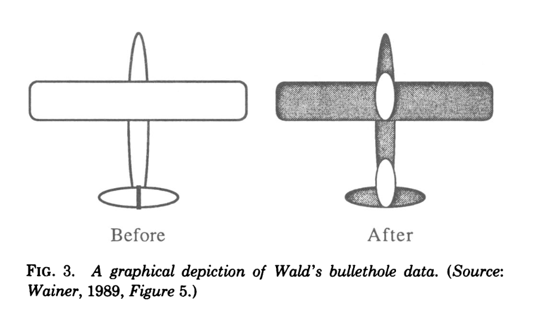

```{r include=FALSE}
library(magrittr)
library(knitr)
library(kableExtra)
```

# Chart Types

<!-- ## Slide title -->

<!-- Place any needed images in `/images/` or link to a URL. -->

<!-- ::: {.flexbox .vcenter} -->
<!--   <small>caption</small> -->
<!-- ::: -->

## The goal is to see

"The greatest value of a picture is when it forces us to notice what we never expected to see."

-- John Tukey

## Howard Wainer (1990) on Playfair and Tukey

Three points of agreement:  

1. Impact is important.  
2. Understanding graphs is not always automatic.

Two categories of good graphs:  

1. A *strongly good graph* shows us everything we need to know just by looking at it.   
2. A *weakly good graph* shows us everything we need to know just by looking at it, once we know how to look.  
3. A graph can show us things easily that might not have been seen otherwise

Legends and annotations can change a weakly good graph into a strongly good graph. Legends and annotations should not just label the graphical objects, but also identify what graphical features are *important*.

## Wald's bullethold data

Illustrating the issue of *survivorship bias*



## One variable (distribution data)

## Boxplot concept

 <small>Source: r-graph-gallery.com</small>

## Boxplot example

 <small>Source: r-graph-gallery.com</small>

## Probability density function

 <small>Source: r-graph-gallery.com</small>

## Ridgeline plots

 <small>Source: r-graph-gallery.com</small>

## Histograms

 <small>Source: r-graph-gallery.com</small>

## Two-dimensional data

## Scatter plot

 <small>Source: r-graph-gallery.com</small>

## Scatter plot with trend line

 <small>Source: r-graph-gallery.com</small>

## Scatter plot with connectors

 <small>Source: r-graph-gallery.com</small>

## Heat map

Used for displaying a data matrix

 <small>Source: r-graph-gallery.com</small>

## Modifications to heat map

 <small>Source: r-graph-gallery.com</small>

## Barplots for a mixture of nominal and quantitative data

 <small>Source: r-graph-gallery.com</small>

## Grouped barplots

 <small>Source: r-graph-gallery.com</small>

## Stacked barplots

 <small>Source: r-graph-gallery.com</small>

## Three-dimensional data

## Bubble plot

 <small>Source: r-graph-gallery.com</small>

## A bubble plot variation for four-dimensional data

 <small>Source: r-graph-gallery.com</small>

## Part-whole relationsips

## Pie chart

 <small>Source: r-graph-gallery.com</small>

## Donut chart

 <small>Source: r-graph-gallery.com</small>


## Waffle plot

 <small>Source: r-charts.com</small>


## Hierarchical data

## Treemap

Used for **nested hierarchical** data

 <small>Source: r-graph-gallery.com</small>

## Dendrogram

Used for **clustered** or **evolutionary** data

 <small>Source: r-graph-gallery.com</small>

## Circular dendrogram

 <small>Source: r-graph-gallery.com</small>

## Small multiples (faceting)

 <small>Source: https://www.r-bloggers.com/2018/04/why-you-should-master-the-small-multiple-chart/</small>

## Pairs plot

 <small>Source: https://intro2r.com/simple-base-r-plots.html/</small>


## Combination graphs


## A boxplot with jittered data points

 <small>Source: r-graph-gallery.com</small>

## Scatter plot with marginal distributions

 <small>Source: r-graph-gallery.com</small>


## Maps

## Choropleth map

 <small>Source: r-graph-gallery.com</small>

## Hexbin

 <small>Source: r-graph-gallery.com</small>

## Cartogram

 <small>Source: r-graph-gallery.com</small>

## Map flows

 <small>Source: r-graph-gallery.com</small>


## Networks (graphs)

## Undirected graph

 <small>Source: r-graph-gallery.com</small>

## Directed graph 

 <small>Source: r-graph-gallery.com</small>

## Graphs provide multiple visual channels

 <small>Source: r-graph-gallery.com</small>


