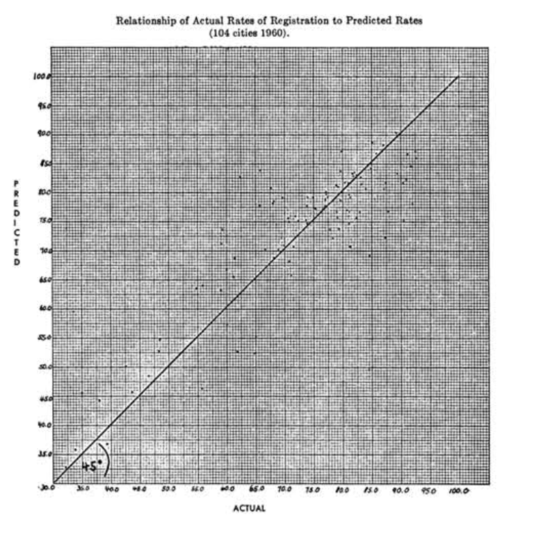
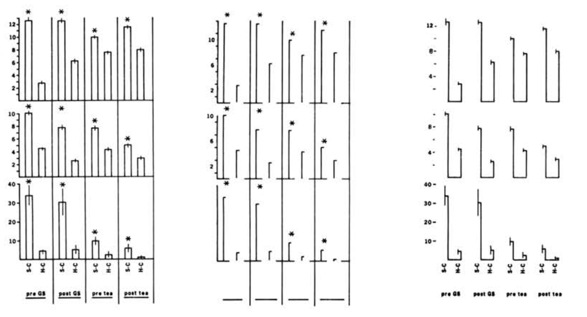

```{r include=FALSE}
library(magrittr)
library(knitr)
library(kableExtra)
```


# Aesthetics

## Design Criteria

### Consistency (-Heer)
The **image properties** (visual variables) should match the **data properties**. TRANSLATION: Don't lie (even by ommission).

### Ordering (-Heer)
Encode the **most important information** in the **most effective way**.

### Effectiveness (-Mackinlay)
The most *effective* visualization conveys information in the most **perceivable** way. (Can be decoded the fastest and most accurately.)

### Expressiveness (-Mackinlay)
Data is *expressible* in a visual language if the signs express **all the facts and only the facts** in the data.

---

### Expressiveness (-Mackinlay)  

::: {.left-column-50}
  
Visual language cannot express all the facts in the data.
:::  
::: {.right-column-50}  
  
Visual language expresses facts not in the data.
::: 

## Tufte's Principles

::: {.left-column-50}
### Integrity (Tufte)

* **graphics proportional to data**<br>(e.g. zero shown, etc.)
  * **perceptually proportional**<br>(Perception is not always linear.)
  * **avoid 3D / perspecitve**<br>due to increased ambiguity
* **use labels** to resolve graphical ambiguity
  * label on the graph itself
  * label important events
* **data dimensions = graphical dimensions**
  * Vary only one graphic element<br>for each data dimension
* **don't quote data out of context**
:::  

::: {.right-column-50}  
### Excellence (Tufte)

* **Clarity**  
* **Precision**
* **Efficiency**

Greatest number of ideas  

in shortest time  

with the least ink  

in the smallest space

### MISC.
* **Multiple y axes: don't do it.**<br>(use panels instead)
::: 

## Tufte's Principles

### Data-Ink Ratio  

$$
\begin{align}
\text{Data-ink Ratio } ~= ~&\frac{\text{data-ink}}{\text{total ink used to print the graphic}} \\\\
 = ~&\text{proportion of a graphic's ink devoted to the} \\
 ~&\text{non-redundant display of data-information} \\\\
 = ~&1 - (\text{proportion of a graphic's ink that can be erased} \\
 ~&\text{without loss of data-information}) \\
\end{align}
$$

---

### Data-Ink Ratio  

* Show the Data  
* Maximize the data-ink ratio (within reason)  
* Erase non-data ink (within reason)  
* Erase redundant data-ink (within reason)  
* Revise / Edit  

---

### Data-Ink Ratio  

::: {.column-30}
**bad**  

:::
::: {.column-30}
**better**  

:::
::: {.column-30}
**best**  

:::

---

### Data-Ink Ratio  

original - redundant = "the good part"  


## Tufte's Principles

### Chart Junk 


# Color

## Perceptually uniform color scales

### Theory: 

<http://datavis-sp16.github.io/lectures/color>

### Takeaway: 

Use the HCL colorspace (a perceptually uniform color space)
(**H**ue, **S**aturation, **L**ightness)

**Lightness** is the most important and most accurate perceptual channel

### R color tools:

- <mark>Base R does not enforce good default colors</mark>
- `{ggplot}`, `{plotly}`, and many other R packages have good defaults.  
- The `{colorspace}` package lets you build HCL color palettes<br>
  GUI: <http://hclwizard.org/r-colorspace/> can also be launched from R: `colorspace::choose_palette()`
- The `{datacolor}` package makes it easier to work with HCL, and also analyzes color palettes<br>
  <https://github.com/allopole/datacolor>

---

**Problem:** Color palette for a binned, continuous variable. 
(e.g. show absolute rainfall quantities AND "low," medium" and "high" rainfall categories)

Palette from <http://www.hclwizard.org/why-hcl/> recreated with
[datacolor](https://github.com/allopole/datacolor) R package

```{r echo=TRUE}
# install.packages(devtools) ## imports {remotes} package
# remotes::install_github("allopole/datacolor")
n <- 12 # palette length
why_hcl <- datacolor::hcl2hex(
  L=100*datacolor::rampx(from = .95, to = .35, n, exponent = 1.65),
  C=100*datacolor::stepx(from = .2, to = .77, n, step.n = n/4),
  H=datacolor::stepx(from = 65,to = 320, n=n, step.n = n/4)
  )
why_hcl
datacolor::colorbar(why_hcl)
```

---

```{r echo=TRUE}
datacolor::colorplot(why_hcl,colorblind=T)
```

---

```{r echo=FALSE}
library(datacolor)
nlevels <- 12

par(mfcol=c(2,3),mar=c(1,0,0,0))
image(datasets::volcano,col = rainbow(nlevels),asp=1,xaxs = "i",yaxs = "i",axes=FALSE)
title(ylab = "normal", line = -1)
image(datasets::volcano,col = colorblind(rainbow(nlevels))$deuteranopia,asp=1,xaxs = "i",yaxs ="i",axes=FALSE)
title(ylab = "deuteranopia", line = -1)
title(xlab = "grDevices::rainbow()", line = 0)
image(datasets::volcano,col = heat(nlevels),asp=1,xaxs = "i",yaxs = "i",axes=FALSE)
image(datasets::volcano,col = colorblind(heat(nlevels))$deuteranopia,asp=1,xaxs = "i",yaxs ="i",axes=FALSE)
title(xlab = "datacolor::heat()", line = 0)
image(datasets::volcano,col = rev(why_hcl),asp=1,xaxs = "i",yaxs = "i",axes=FALSE)
image(datasets::volcano,col = colorblind(rev(why_hcl))$deuteranopia,asp=1,xaxs = "i",yaxs ="i",axes=FALSE)
title(xlab = "http://www.hclwizard.org/why-hcl/", line = 0)
```


---

```{r echo=FALSE}
library(datacolor)
nlevels <- 12

par(mfcol=c(3,3),mar=c(1,0,0,0))
image(datasets::volcano,col = rainbow(nlevels),asp=1,xaxs = "i",yaxs = "i",axes=FALSE)
title(ylab = "normal", line = -1)
image(datasets::volcano,col = colorblind(rainbow(nlevels))$deuteranopia,asp=1,xaxs = "i",yaxs ="i",axes=FALSE)
title(ylab = "deuteranopia", line = -1)
image(datasets::volcano,col = colorblind(rainbow(nlevels))$greyscale,asp=1,xaxs = "i",yaxs ="i",axes=FALSE)
title(ylab = "greyscale", line = -1)
title(xlab = "grDevices::rainbow()", line = 0)
image(datasets::volcano,col = heat(nlevels),asp=1,xaxs = "i",yaxs = "i",axes=FALSE)
image(datasets::volcano,col = colorblind(heat(nlevels))$deuteranopia,asp=1,xaxs = "i",yaxs ="i",axes=FALSE)
image(datasets::volcano,col = colorblind(heat(nlevels))$greyscale,asp=1,xaxs = "i",yaxs ="i",axes=FALSE)
title(xlab = "datacolor::heat()", line = 0)
image(datasets::volcano,col = rev(why_hcl),asp=1,xaxs = "i",yaxs = "i",axes=FALSE)
image(datasets::volcano,col = colorblind(rev(why_hcl))$deuteranopia,asp=1,xaxs = "i",yaxs ="i",axes=FALSE)
image(datasets::volcano,col = colorblind(rev(why_hcl))$greyscale,asp=1,xaxs = "i",yaxs ="i",axes=FALSE)

title(xlab = "http://www.hclwizard.org/why-hcl/", line = 0)
```


## Readings


Kelleher, C. and Wagener, T., 2011. [Ten guidelines for effective data visualization in scientific publications.](https://www.sciencedirect.com/science/article/pii/S1364815210003270) Environmental Modelling & Software, 26(6), pp.822-827.

Rougier, N.P., Droettboom, M. and Bourne, P.E., 2014. [Ten simple rules for better figures.](https://journals.plos.org/ploscompbiol/article?id=10.1371/journal.pcbi.1003833) PLoS Comput Biol, 10(9), p.e1003833.

Gregor Aisch (former graphics editor, New York Times). [*Using Data Visualization to Find Insights in Data.*](https://datajournalism.com/read/handbook/one/understanding-data/using-data-visualization-to-find-insights-in-data) DataJournalism.com

Hadley Wickham (2010) [A Layered Grammar of Graphics.](https://www.tandfonline.com/doi/abs/10.1198/jcgs.2009.07098) Journal of Computational and Graphical Statistics 19:3-28.

Tufte, Edward: 

- *The Visual Display of Quantitative Information.* Graphics Press, 1983.    
- *Envisioning Information.* Graphics Press, 1990.  
- *The Visual Design of Quantitative Information.* Graphics Press, 1992.  
- *Visual Explanations: Images and Quantities, Evidence and Narrative.* Graphics Press, 1997. 


