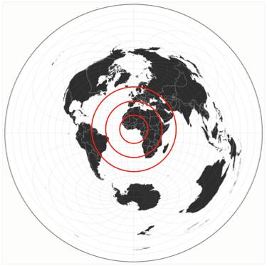
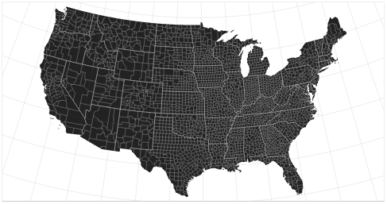
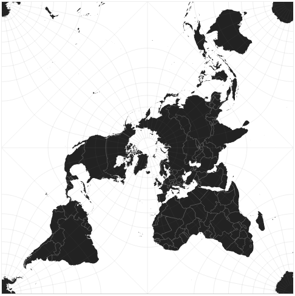
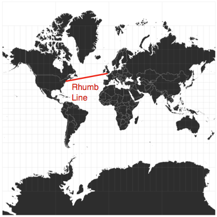

```{r include=FALSE}
library(magrittr)
library(knitr)
library(kableExtra)
```

# Maps


## {.flexbox .vcenter}

  
<small>Henricus Martelus, WORLD MAP, c1490</small>

## {.flexbox .vcenter}
  
<small>John Snow: Mapped positions of deaths from cholera in London.  
The map revealed a cluster of cases around a water pump, with density of cases  
decreasing with distance from the pump. 1854.</small>

## {.flexbox .vcenter}

  
<small>Charles Booth: Descriptive map of London poverty, 1889. [info](https://commons.wikimedia.org/wiki/File:Descriptive_map_of_London_poverty,_1889_Wellcome_L0074435.jpg)</small>

## {.flexbox .vcenter}

<iframe src="https://earth.nullschool.net"></iframe>
<https://earth.nullschool.net>

## Map Projections

A **Projection** is a systematic (mathematical) "stretching" of the surface of the sphere onto a flat plane.  Every projection preserves some aspects of the geometry and distorts other aspects.  

Therefore, there is no truthful map of the earth.

**3 categories of Map Projections:**

* Azimuthal
	* Preserves direction and distance
* Equal Area
	* Preserves area
* Conformal
	* Preserves local angles (straight lines on the sphere look straight on the plane.)

[Wikipedia: Map Projections](https://en.wikipedia.org/wiki/Map_projection)

## Map Projections {.flexbox}

* Azimuthal (Preserves direction and distance)
	* [example: "Azimuthal Equidistant"](http://en.wikipedia.org/wiki/Azimuthal_equidistant_projection)

  

## Map Projections {.flexbox}

* Equal Area (Preserves area)
	* [example: "Albers Equal Area Conic"](http://en.wikipedia.org/wiki/Albers_projection)
	
  
<small><https://observablehq.com/@d3/conic-equal-area></small>

## Map Projections {.flexbox}

* Conformal (Preserves local angles)
	* [example: "Peirce Quincuncial"](http://en.wikipedia.org/wiki/Peirce_quincuncial_projection)
	
  
<small><https://observablehq.com/@d3/peirce-quincuncial></small>

## Map Projections {.flexbox}

* Conformal (Preserves local angles)
	* [example: "Mercator"](http://en.wikipedia.org/wiki/Mercator_projection)
	
  
<https://observablehq.com/@d3/mercator></small>

## Map Projections: [Tissot's Indicatrix](https://en.wikipedia.org/wiki/Tissot%27s_indicatrix)

:::: {.flexbox}
::: {style="width:20%"}
  
<small>Orthographic</small>
:::

::: {style="width:20%"}
  
<small>Azimuthal Equidistant</small>
:::

::: {style="width:20%"}
  
<small>Mercator</small>
:::
::: {} 
&nbsp; 
:::

::: {style="width:20%"}
  
<small>Peirce Quincuncial</small>
:::
::::

:::: {.flexbox}
::: {style="width:30%"}
  
<small>Albers</small>
:::
::: {style="width:25%"}
  
<small>Dymaxion (<https://en.wikipedia.org/wiki/Dymaxion_map>)</small>
:::
::: {style="width:10%"} 
&nbsp;
:::
::: {style="width:25%"}
  
<small>Human migrations according to mitochondrial population genetics (millennia before present)</small>  

:::
::::

## {}


<small><http://xkcd.com/977></small>

## Map Scale

**For a small area, earth's curvature can be ignored, and a map can use a single scale.**

**For a large area, map projections cause any scale to be variable**


**Scale is often expressed as a ratio without units**

1:250,000

This concept is borrowed from print, where the dimensions of a printed map are constant.  For screen, since the physical dimensions of the image can vary with the screen, ratio scales are less useful.  Therefore, online, we tend to use graphic scale bars.

## Map Scale

**Content should be appropriate to the scale.**


Modern mapping tools can dynamically control what content is visiable at each scale level, automatically.


## Map Types

* Symbol Maps
	* Dot Map
	* Bubble Map
* Continuous Data
	* Heatmaps
	* Choropleth
* Cartograms
* Flow Maps

## Map Types

::: {.left-column}
* Symbol Maps
	* <mark>Dot Map</mark>
	* Bubble Map
* Continuous Data
	* Heatmaps
	* Choropleth
* Cartograms
* Flow Maps
:::

::: {.right-column-fat}

:::

## Map Types

::: {.left-column}
* Symbol Maps
	* Dot Map
	* <mark>Bubble Map</mark>
* Continuous Data
	* Heatmaps
	* Choropleth
* Cartograms
* Flow Maps
:::

::: {.right-column-fat}

:::


## Map Types

::: {.left-column}
* Symbol Maps
	* Dot Map
	* Bubble Map
* Continuous Data
	* <mark>Heatmaps</mark>
	* Choropleth
* Cartograms
* Flow Maps
:::

::: {.right-column-fat}
  
<small>Most photographed areas</small>
:::

## Map Types

::: {.left-column}
* Symbol Maps
	* Dot Map
	* Bubble Map
* Continuous Data
	* Heatmaps
	* <mark>Choropleth</mark>
* Cartograms
* Flow Maps
:::

::: {.right-column-fat}
  
<small>Australian_Census_2011: Anglicans as a proportion of the population</small>
:::


## Map Types

::: {.left-column}
* Symbol Maps
	* Dot Map
	* <mark>Bubble Map</mark>
* Continuous Data
	* Heatmaps
	* <mark>Choropleth</mark>
* Cartograms
* Flow Maps
::: 
::: {.right-column-fat}

:::


## Map Types

::: {.left-column}
* Symbol Maps
	* Dot Map
	* Bubble Map
* Continuous Data
	* Heatmaps
	* Choropleth
* <mark>Cartograms</mark>
* Flow Maps
::: 
::: {.right-column-fat}

::: 


## Map Types

::: {.left-column}
* Symbol Maps
	* Dot Map
	* Bubble Map
* Continuous Data
	* Heatmaps
	* Choropleth
* <mark>Cartograms</mark>
* Flow Maps
::: 
::: {.right-column-fat}
[https://en.wikipedia.org/wiki/Cartogram](https://en.wikipedia.org/wiki/Cartogram)  
 
::: 

## Map Types

::: {.left-column}
* Symbol Maps
	* Dot Map
	* Bubble Map
* Continuous Data
	* Heatmaps
	* Choropleth
* Cartograms
* <mark>Flow Maps</mark>
::: 
::: {.right-column-fat}
Flow maps display flows (vectors fields: direction and magnitude)  
<small><https://earth.nullschool.net> </small>   
<iframe src="https://classic.nullschool.net/#current/wind/surface/level/orthographic=-81.65,30.48,2160"></iframe>

::: 


